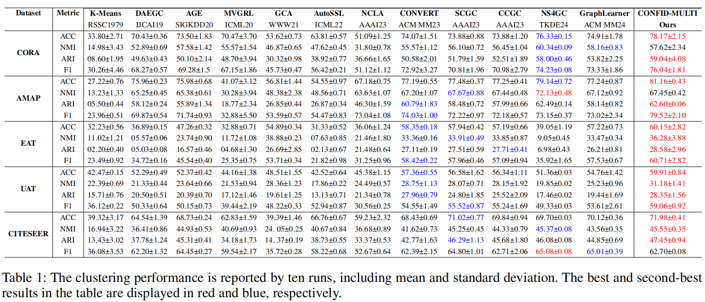

# Enhancing Contrastive Graph Clustering with Reliable Sample Selection
-------------

### Overview

<div  align="center">    
    
</div>


### 🎆Requirements

- torch==1.8.1
- tqdm==4.59.0
- numpy==1.19.2
- munkres==1.1.4
- scikit_learn==1.2.0

### Implementation Details
All the experiments are conducted on NVIDIA RTX 3090 GPU with 24 GB RAM, and the PyTorch framework. The clustering performance of proposed models is reported by ten runs, including mean and standard deviation. The training process could be divided into two steps: In the first step, learning robust node features from multiple complementary views via selected high-confidence samples to improve the model’s ability to distinguish between positive and negative samples. In the second step, the clustering objective guided distribution alignment for reliable samples is adopted to improve the final clustering performance.

### Quick Start

```
python train.py
```


### 🤝Clustering Results

<div  align="center">    
    
</div>

<div  align="center">    
    
</div>

### Citation
```
@inproceedings{CONFID-MULTI,
  title={Enhancing Contrastive Graph Clustering with Reliable Sample Selection},
  author={},
  booktitle={},
  volume={},
  number={},
  pages={},
  year={}
}
```
