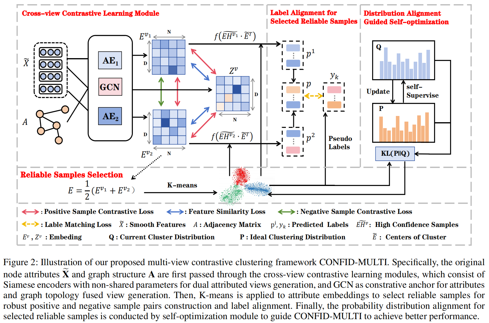

# Enhancing Contrastive Graph Clustering with Reliable Sample Selection
-------------

### Overview

<div  align="center">    
    
</div>


### Requirements

The proposed CONFID-MULTI is implemented with python 3.8 on a NVIDIA 3090 GPU. 

- torch==1.8.1
- tqdm==4.59.0
- numpy==1.19.2
- munkres==1.1.4
- scikit_learn==1.2.0


### Quick Start

python train.py


### Clustering Results

<div  align="center">    
    
</div>


### Citation

If you find this project useful for your research, please cite your paper with the following BibTeX entry.

```
@inproceedings{CONFID-MULTI,
  title={Enhancing Contrastive Graph Clustering with Reliable Sample Selection},
  author={},
  booktitle={},
  volume={},
  number={},
  pages={},
  year={}
}
```
